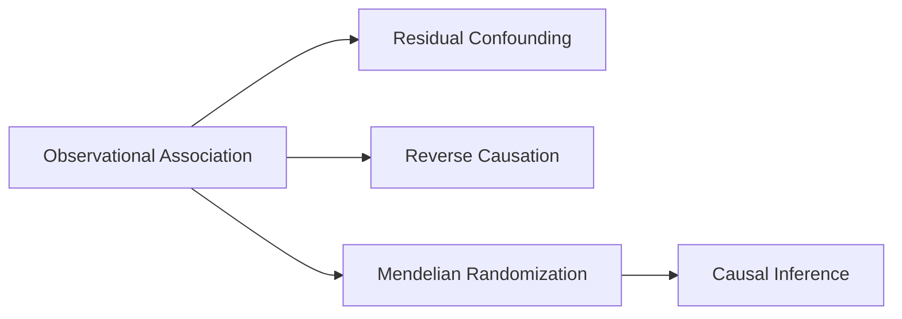

# 🫀 Bidirectional Association Between Systemic Cardiovascular Diseases and Glaucoma Progression

## 📌 Project Overview
A comprehensive real-world evidence (RWE) study investigating the complex bidirectional relationship between cardiovascular diseases (CVD) and glaucoma progression using the TriNetX global federated health network. This research combines advanced epidemiological methods with R-based analytics to uncover significant clinical associations with implications for integrated patient care.


## 🎯 Key Findings

### 🔍 Primary Association Results
| **Outcome** | **AS Group Events** | **Non-AS Group Events** | **Adjusted HR** | **95% CI** | **p-value** |
|------------|-------------------|----------------------|-----------------|------------|-------------|
| **Glaucoma** | 11,717 | 8,676 | **1.277** | 1.242–1.312 | **< 0.001** |
| **Ischemic Optic Neuropathy** | 566 | 391 | **1.362** | 1.197–1.549 | **< 0.001** |

### 📊 Key Statistical Insights
- **27.7% higher risk** of glaucoma in aortic stenosis patients
- **36.2% higher risk** of ischemic optic neuropathy
- **Duration-response relationship**: Longer AS duration correlates with increased risk
- **Subgroup variations**: Association consistent across demographics except Asian patients and specific age groups

## 🧬 Anatomical & Pathophysiological Framework

### Retinal Blood Supply Anatomy

*Figure 1: The anatomical depiction of retinal blood supply showing vulnerability of retinal ganglion cells to vascular compromise*

### Proposed Pathophysiological Mechanism

*Figure 2: Systematic hemodynamic diseases reducing retinal blood flow through multiple pathways*

## 📚 Methodology

### 🗃️ Data Source & Study Design
- **Platform**: TriNetX Global Federated Health Network
- **Cohort**: 37,841 patients from 68 healthcare institutions
- **Design**: Retrospective matched-cohort study
- **Data Type**: De-identified Electronic Health Records (EHR)

### 🔧 Analytical Framework
```r
# Core R Packages Used
library(tidyverse)    # Data manipulation
library(survival)     # Cox proportional hazards
library(MatchIt)      # Propensity score matching
library(ggplot2)      # Data visualization

# Statistical Pipeline
1. Data cleaning & preprocessing
2. Propensity Score Matching (PSM)
3. Cox proportional hazards regression
4. Subgroup analysis & sensitivity testing
```

### 📊 TriNetX Platform Integration

*Figure 3: TriNetX standard codes for advanced search and cohort identification*

## 🏗️ Research Architecture

### Study Objectives
1. **Forward-Direction**: Assess CVD → Glaucoma progression association
2. **Reverse-Direction**: Examine Glaucoma → CVD incidence relationship
3. **Duration Analysis**: Investigate time-dependent effects
4. **Demographic Modification**: Analyze subgroup variations

### Hypotheses Tested
- **H₀-F**: No association between CVD and subsequent glaucoma risk
- **H₁-F**: Significant positive association exists
- **H₀-R**: No association between glaucoma and subsequent CVD risk
- **H₁-R**: Significant positive association exists

## 📈 Results & Clinical Implications

### Temporal Trends Analysis
```r
# Temporal trend visualization code
ggplot(overall_trends, aes(x=Year, y=Mean_Value, color=Topic, group=Topic)) +
  geom_line(size=1.2) +
  labs(title="Temporal Trends of CVD Prevalence in U.S. Medicare Population",
       x="Year", y="Mean Prevalence (%)", color="Disease Topic") +
  theme_minimal()
```

### Subgroup Analysis Findings
| **Patient Characteristic** | **aHR** | **95% CI** | **Significance** |
|---------------------------|---------|------------|------------------|
| **All Patients** | 1.362 | 1.197–1.549 | **p < 0.001** |
| **Non-Asian Race** | >1.0 | Excludes 1 | Significant |
| **Asian Race** | NS | Includes 1 | Not Significant |
| **Age 45-64 years** | >1.0 | Excludes 1 | Significant |

## 🧪 Advanced Methodological Considerations

### Causal Inference Framework


### Mendelian Randomization Principles
1. **Relevance Condition**: Genetic variant → Exposure association
2. **Exclusion Restriction**: Variant → Outcome only through exposure
3. **Independence Condition**: No confounding between variant and outcome

## 💡 Clinical & Research Recommendations

### For Clinical Practice
- **Integrated Screening**: CVD patients → Ophthalmic evaluation
- **Holistic Management**: Coordinated cardio-ophthalmic care
- **Patient Education**: Shared risk factor awareness

### For Future Research
1. **Mendelian Randomization Studies** to establish causality
2. **Longitudinal Designs** for temporal sequencing
3. **Intervention Trials** testing integrated management
4. **Advanced ML Models** for risk prediction

### For Data Science
- **Open-source R pipelines** for RWE analysis
- **Federated learning** applications in healthcare
- **Advanced modeling** of complex disease interactions

## 🛠️ Technical Implementation

### Data Processing Pipeline
```r
# Data cleaning workflow
cardio_data_cleaned <- cardio_data %>%
  mutate(Data_Value = as.numeric(Data_Value)) %>%
  select(-Data_Value_Alt, -starts_with("PriorityArea")) %>%
  mutate(across(c(LocationAbbr, Topic, Break_Out_Category), as.factor))

# PSM implementation
matched_data <- matchit(AS_Group ~ Age + Gender + Comorbidities,
                        data = analysis_df, method = "nearest")
```

### Statistical Modeling
```r
# Cox proportional hazards model
cox_model <- coxph(Surv(Time_To_Event, Event_Status) ~ AS_Group +
                     strata(Age_Group) + cluster(LocationID),
                   data = matched_df)
```

## 📋 Project Structure
```
cardiovascular-glaucoma-study/
├── data/
│   ├── raw/                 # Original TriNetX extracts
│   ├── processed/           # Cleaned datasets
│   └── metadata/           # Codebooks & documentation
├── analysis/
│   ├── r-scripts/          # R analysis scripts
│   ├── notebooks/          # Jupyter/RMarkdown notebooks
│   └── results/            # Statistical outputs
├── visualizations/
│   ├── figures/            # Publication-ready figures
│   └── dashboards/         # Interactive visualizations
└── documentation/
    ├── methodology/        # Study protocols
    └── supplementary/      # Appendices & supplements
```

## 📊 Ethical Considerations & Compliance
- **HIPAA/GDPR Compliance**: De-identified data handling
- **IRB Approval**: Non-human subjects research classification
- **Data Use Agreements**: TriNetX platform compliance
- **Privacy Protection**: Federated learning approach

## 🎓 Academic Contributions

### Theoretical Implications
- **Validates vascular hypothesis** of glaucoma
- **Establishes duration-response relationship**
- **Identifies demographic effect modifiers**
- **Provides framework for bidirectional disease research**

### Practical Applications
- **Clinical screening guidelines**
- **Integrated care protocols**
- **Risk stratification tools**
- **Patient management algorithms**

## 📞 Contact & Collaboration

**Primary Investigator**: Were Vincent O

**Data Access**: TriNetX Platform (https://trinetx.com)  

**Code Repository**: https://github.com/VincentOracle/Bidirectional-Association-Between-Systemic-Cardiovascular-Diseases-and-Glaucoma-Progression/edit/master/README.md  
**Analytical Tools**: R, Python, TriNetX BYOM  

**For Collaboration**:  
- Research partnerships welcome
- Data sharing inquiries
- Methodological consultations
- Clinical implementation support

---

## 📚 References & Citations

### Key Publications
1. **TriNetX Database Study** (2025) - Primary association findings
2. **Mendelian Randomization Methods** - Causal inference framework
3. **Vascular Hypothesis Literature** - Pathophysiological basis
4. **Epidemiological Guidelines** - Study design standards

### Technical Documentation
- TriNetX Platform Documentation
- R Statistical Computing Resources
- HIPAA/GDPR Compliance Guidelines
- Institutional Review Board Protocols

---

**Last Updated**: January 2026  
**Project Status**: Research Complete - Manuscript in Preparation  
**License**: Academic Use with Attribution  

*This research contributes to the growing evidence for integrated cardio-ophthalmic care and demonstrates the power of real-world evidence in uncovering complex disease relationships.*
